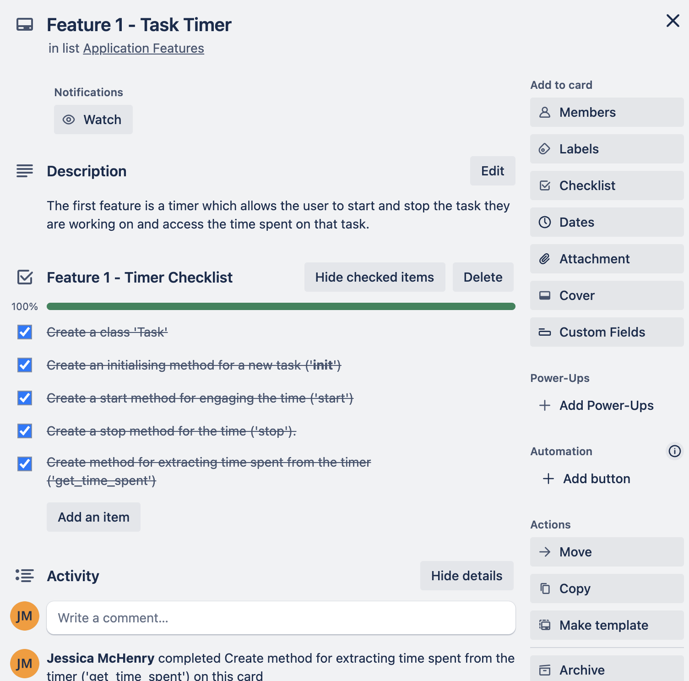
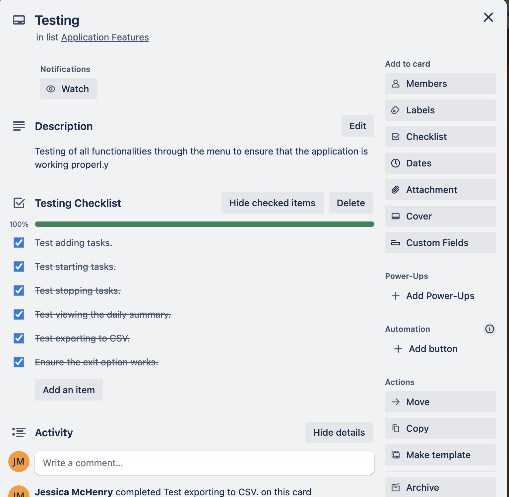

### T1A3 - Terminal Application | Jessica McHenry

This terminal application has been created to meet the requirements of Coder Academy Term 1 Assignment 3.
___________________

Objective of the application: This application is a Task Tracker and helps users to manage and report accurately on their productivity levels over a range of activities. Users input their activities and use the application's timer to time how long they spend doing each one. 

The application can then give a daily summary showing how much time was spent on which task. This report can also be exported to CSV.

The [Help Documentation](#help-documentation) contains instructions for installing and utilising the application.

This [Github repository](https://github.com/mchjess/t1a3python) was used for this application.

This [Trello board](https://trello.com/b/tQ73kRWU/implementation-plan) was used to manage the project.

_________

### Table of Contents

* [Features of the application](#features)
    1. [Timer](#1-timer)
    2. [Daily Summary](#2-daily-summary)
    3. [Exportabe CSV report](#3-exportable-csv-report)

* [Code Style Guide](#style-guide)
* [Implementation Plan](#implementation-plan)
* [Testing](#testing)
* [Help Documentation](#help-documentation)
* [References](#references)

### Features

This application has many transferrable uses. It accurately measures time spent on a user-inputted task and then returns a summary of all time spent on all tasks. This application captures and reports data for the user to interpret as they see fit.

The application has a simple menu interface with options 1 - 5 to complete the following operations:

* Task Management: Add, start, and stop tasks. 
* Time Tracking: Record time spent on each task.
* Daily Summary: Generate daily summaries of time spent per task category.
* Data Export: Export task data to a CSV file for further analysis.

#### 1. Timer

Users start and stop the timer after they have added the task they wish to track. The application relies on the user to initiate the timer and they must input the correct commands.

#### 2. Daily Summary

Users can access a Daily Summary of all tasks and time spent on the fly as they need it. Although this is called a 'daily' summary, this feature is really an intermittent summary which the user can choose to access at any time.

#### 3. Exportable CSV report

Users also have the option of exporting their summary data to a CSV report which they can separately store and review or input into applications like Excel for more detailed reporting and record storage.

### Style Guide

I have applied the standard style guide for [Python PEP 8](https://peps.python.org/pep-0008/).

The following conventions are adhered to in accordance with this style guide:

* Indentation - 4 spaces used for each level of indentation consistently throughout your code.
* Line length - lines are limited to 79 characters whereever possible.
* Naming conventions - I have used snake_case for functions and variables (add_task, start_task) and CamelCase for classes (ProductivityTracker, Task).
* Imports - libraries used listed on separate lines at the top of my file.

### Implementation Plan

To breakdown the creation of the application, I used a Trello board. This kept track of coding requirements for each element of the application and testing.

### Testing

Once the application was fully coded, I tested the Menu functionality to ensure that all options worked. The following summary includes all testing and debugging required.

#### Testing Results

1. Tested adding tasks.

    First test - failed. 
 
   Actions - Initial issue with tasks not saving to the list of tasks. Error addressed with syntax change and addition of confirmation of task added. 
    
    Second test - failed. (Task class causing an issue when adding a new task. Category option removed and problem solved.)

    Third test - passed.

 2. Tested starting tasks.
    First test - passed.

3. Tested stopping tasks.
    First test - failed. (Initial issue with timer. Incorrect syntax changed.)

    Second test - passed.

 4. Tested viewing the daily summary.
    First test - failed. (Category option was causing the problem. Category removed and syntax changed to Activities.)

    Second test - passed.

 5. Tested exporting to CSV.
    First test - passed.

 6. Ensured the exit option works.
    First test - passed.

### Help Documentation

#### 1. Introduction

The ProductivityTracker application is a command-line tool designed to help you manage your tasks and track the time spent on each task. You can add tasks, start and stop timing them, view a daily summary, and export your task data to a CSV file.
 
#### 2. Installation
Requirements
•	Python 3.6 or higher.
•	time and csv modules (included in the Python Standard Library).

##### Installation Steps
1.	Download the Code: Obtain the task_tracker.py file from the provided repository or source.
2.	Save the File: Save the task_tracker.py file in a directory on your computer.
3.	Open Terminal/Command Prompt: Navigate to the directory where you saved the file.

#### 3. Running the Application
To start the application, open your terminal or command prompt and navigate to the directory where you saved task_tracker.py. 

Run the following command:
python3 task_tracker.py

#### 4. Using the Application
Upon running the application, you will be presented with a menu of options. 

Here is a breakdown of each option:

##### 4.1 Add a Task

1.	Select Option 1: From the main menu, type 1 and press Enter.
2.	Enter Task Name: Type the name of the task and press Enter.

##### 4.2 Start a Task
1.	Select Option 2: From the main menu, type 2 and press Enter.
2.	Enter Task Name: Type the name of the task you want to start and press Enter.

##### 4.3 Stop a Task
1.	Select Option 3: From the main menu, type 3 and press Enter.
2.	Enter Task Name: Type the name of the task you want to stop and press Enter.

##### 4.4 View Daily Summary
1.	Select Option 4: From the main menu, type 4 and press Enter.
2.	View Summary: The application will display a summary of the time spent on tasks.

##### 4.5 Export Data to CSV
1.	Select Option 5: From the main menu, type 5 and press Enter.
2.	Enter Filename: Type the desired filename for the CSV export and press Enter.

##### 4.6 Exit the Application
1.	Select Option 6: From the main menu, type 6 and press Enter.
2.	Confirm Exit: The application will display a goodbye message and exit.

End of user documentation.

### References

